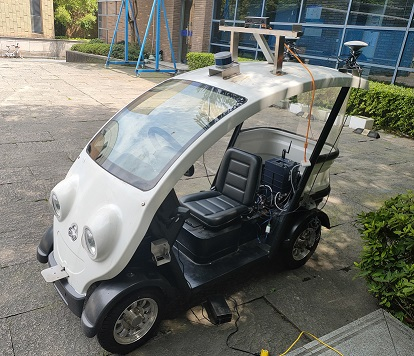
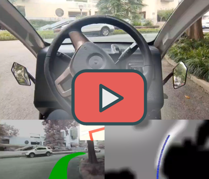

# RoBoCar
[](https://arxiv.org/abs/2010.10393)
[](https://opensource.org/licenses/MIT)

This repository is for the robot car development, including main program, sensors test scripts, auto install scripts, helpful tools, etc.



#### Sensors used:
* LiDAR: [Velodyne VLP-16](https://www.velodynelidar.com/vlp-16.html)
* Camera: [MYNT EYE D-1000-120](https://www.myntai.com/mynteye/depth)
* GPS: [千寻 D300-GNSS](https://mall.qxwz.com/market/products/details?name=ouabiwv7762375598)
* IMU： [Xsens MTi-300-2A8G4](https://www.mouser.com/ProductDetail/Xsens/MTI-300-2A8G4?qs=sGAEpiMZZMutXGli8Ay4kNSxHzx9HmD09sFWWfMc%252BdM%3D)

### Learning Module
* Learning models
  * Driving Intention Module: learning/models.py GeneratorUNet and Discriminator
  * Trajectory Generation Module: learning/path_model.py ModelGRU
* Train model
```bash
python scripts/carla/train_path.py
python scripts/carla/train_GAN.py
```


### Install
```bash
cd scripts
bash install.sh
```

### Features

* Camera image reading in python with pybind11
```bash
bash device/camera/build.sh
python device/camera/run.py
```
* LiDAR data reading
```bash
cd device/lidar/velodyne-driver
mkdir build
cd build
cmake ..
make -j16
sudo make install
cd ../../
python lidar.py
```
* IMU data reading
```bash
bash scripts/real/get_permission.sh
python device/imu/mtnode.py
```
* XBox control
  * Right axis up: speed
  * Top axis left and right: rotation
  * Buttom Y: forward
  * Buttom A: backward
  * Buttom LOG: break and stop
  * Hat up and down: increase or reduce max speed
  * Hat right and left: increase or reduce acceleration
```bash
bash scripts/real/get_permission.sh
cd device/controller
python xbox.py
```

### ROS Wrapper
#### Build
```bash
cd ROS
bash build.sh
```

#### Launch
```bash
source devel/setup.bash
roslaunch mynteye_wrapper_d mynteye.launch
roslaunch velodyne_pointcloud VLP16_points.launch
python src/gps/scripts/run_gps.py
python src/imu/scripts/mtnode.py
```

#### Record
```bash
rosbag record /mynteye/left/image_color /velodyne_points /gps /imu
```

#### Read Rosbag
```bash
python ROS/src/tools/save_img.py -d 1 -b 2020-07-11-17-50-49.bag
```

#### Calibration
```bash
cd ROS
bash run_collect.sh
```


### Robot Parameter

* Shaft length ： 688.008mm
* Axle distance ：1448.555mm
* Voltage : 48V


### Video

[](https://www.youtube.com/watch?v=J6K-gSU12j8&t=4s&ab_channel=ZJURoboticsLab)


### Citation
If you use our source code, please consider citing the following:
```bibtex
@article{wang2020imitation,
  title={Imitation Learning of Hierarchical Driving Model: from Continuous Intention to Continuous Trajectory},
  author={Wang, Yunkai and Zhang, Dongkun and Wang, Jingke and Chen, Zexi and Wang, Yue and Xiong, Rong},
  journal={arXiv preprint arXiv:2010.10393},
  year={2020}
}
```